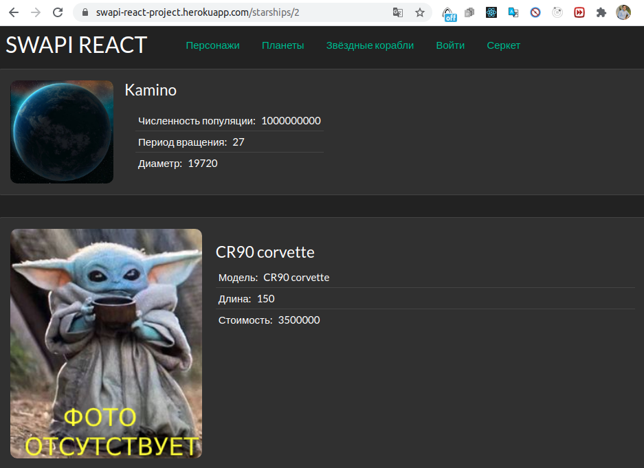

# SWAPI REACT PROJECT

### [Ссылка приложения на heroku ](https://swapi-react-project.herokuapp.com/)
#### Приложение взаимодействует с внешним апи, обрабатывает и выводит информацию...
 Используемый стек хегнологий:
 + React && React Router Dom
 + Bootstrap
 + Node.js
 + Express
 
 
 Данное приложения демонстрирует паттерны проектирования в React, поэтому добро пожалоать в сам код.
 
 ## Описание приложения:
 *Рисунок 1. Главная страница* 
 
 
 
 Здесь мы видим навигационное меню, ниже находится компонент где с определенной периодичностью выводится информация о случайной планете (данный компонент присутствует на всех страницах).
 Ниже видим преветствие главной страницы.
 Далее переходим в раздел "Персонажи"
 
 ---
 
 *Рисунок 2. Персонажи (список)* 
  
 
  
  Здесь представлен список персонажей. При нажатии с правой стороны открывается информация о персонаже. 
  
  ---
  
 *Рисунок 3. Персонажи (информация)* 
  
 
  
   Информация о персонаже, также обратите внимание на url, тут предоставляется возможность скопировать и сохранить данный адрес в текущем состоянии.
  
  ---
  
 *Рисунок 4. Планеты * 
    

  
  Тут представлена информация о планете. Не всегда у api присутствуют нужны поля, поэтому приходится импровизировать.
  Также обратите внимание на url,  не будет возможности скопировать и сохранить url в текущем состоянии.
  
  ---
  
 *Рисунок 5. Звездные корабли* 
  

  
 Корабли в свою очередь открываются заменяя за собой весь блок. (тем самым проработали три варианта)
  
  ---
  
 *Рисунок 6. Секретная страница* 
    

  
  Тут иммитация попадания к закрытому ресурсу, вам нужно залогиниться.
  
  ---
  
 *Рисунок 7. Секретная страница* 
      

  

  ---
  
 *Рисунок 8. Страница не найдена* 
        

  
  Пытаемся перети например в /sdfsd
  
  ---
  
 *Рисунок 9. Фатальная ошибка.* 
          
 
  
  Конечно перед заливкой код протестировал, поэтому чтоб  вызвать критическую ошибку пришлось код руками испортить. Главное чтоб пользователь  недоeмевал в чем проблема в ожидании пока сайт пытается что то загрузить (user friendly).
  
  

  

  
  
  
  
  
  
 
 
 
